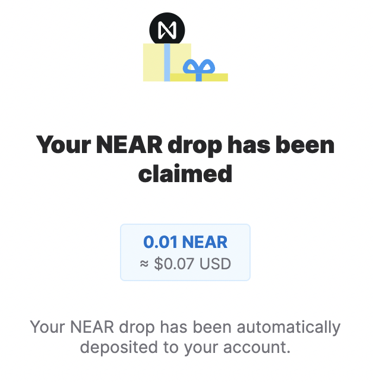
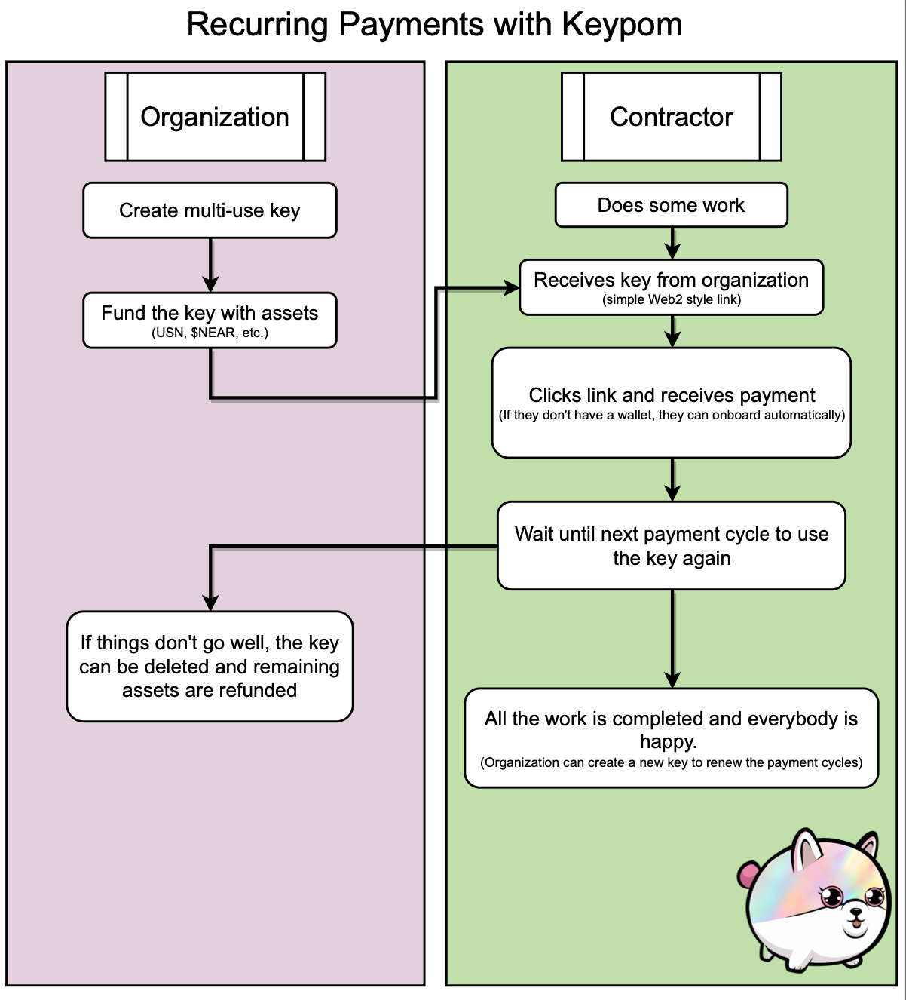
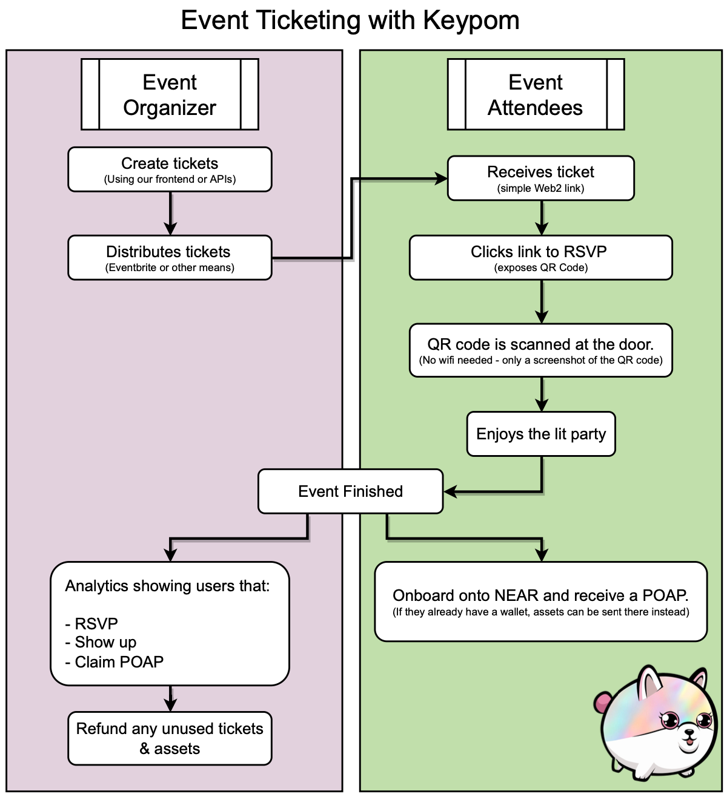
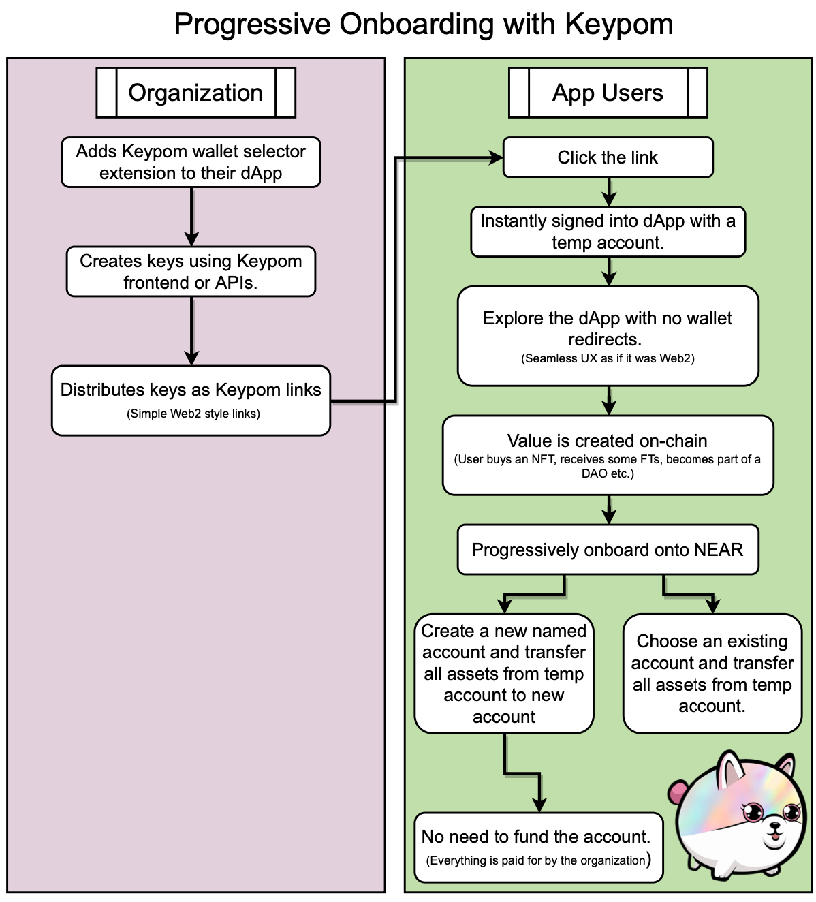

<p align="center">
  
  <br />
</p>

<div align="center">
  <h1>
  Keypom
  </h1>
  Limitless possibilities in the palm of your hand.
</div>

<div align="center">
<br />

[](https://github.com/BenKurrek)
[](https://github.com/mattlockyer)


</div>

<details open="open">
<summary>Table of Contents</summary>

- [About](#about)
  - [Introduction](#introduction)
  - [Comparable Solutions](#comparable-solutions)
- [Our Solution](#our-solution)
  - [Drop Customization](#shared-drop-customization)
  - [Simple Drops](#simple-drops)
  - [NFT Drops](#non-fungible-token-drops)
  - [FT Drops](#fungible-token-drops)
  - [Function Call Drops](#function-call-drops)
  - [Password Protected Keys](#password-protected-keys)
  - [dApp Free Trials for Users](#dapp-free-trials-for-users)
- [Costs](#costs)
  - [Per Drop](#per-drop)
  - [Per Key](#per-key)
  - [Deleting Keys and Drops](#deleting-keys-and-drops)
  - [Automatic Refunds](#automatic-refunds-when-keys-are-used)
  - [Account Balances](#account-balances-for-smooth-ux)
- [How Linkdrops Work](#how-linkdrops-work)
- [Getting Started](#getting-started)
  - [Prerequisites](#prerequisites)
  - [Deploy Scripts](#deploy-scripts)  
- [Query Information From Keypom](#query-information-from-keypom)
  - [Key Specific](#key-specific)
  - [Drop Specific](#drop-specific)    
- [Running Tests](#running-the-keypom-tests)
- [Contributing](#contributing)
- [Acknowledgements](#acknowledgements)

</details>

---

# About

<tr>
<td>

> To view our debut talk at NEARCON 2022, click [here](https://www.youtube.com/watch?v=J-BOnfhHV50).

Keypom is an access key factory created as a result of 3 common problems that arose in the ecosystem.

1. People want a *cheap, customizable, and unique* onboarding experience for users.
2. Companies don't want to expose **full access keys** in their backend servers.
3. dApps want a *smooth UX* with zero barrier to entry onboarding.

The contract was initially created as a way to handle the 1 $NEAR minimum deposit required for creating linkdrops using the [regular linkdrop contract](https://github.com/near/near-linkdrop/blob/f24f2608e1558db773f2408a28849d330abb3881/src/lib.rs#L18). 

If users wanted to create linkdrops, they needed to attach a **minimum** of 1 $NEAR. This made it costly and unscalable for projects that wanted to mass onboard onto NEAR. Keypom, on the other hand, has been highly optimized to allow for the lowest possible costs.

## Introduction

Blockchain technology comes with many benefits such as sovereign ownership, digital rights, privacy, freedom, 
peer to peer coordination and much more. The problem with this technology, however, is that there is an extremely 
high barrier to entry for an everyday individual. None of it matters if nobody can onboard.

It’s confusing to create and fund a crypto wallet. People are unfamiliar with the process, technical jargon, 
and the general flow. NEAR’s account model is powerful, but extremely underutilized because it’s complex for 
developers to take full advantage of. Keypom wraps this up in a single API call.

With NEAR’s goal of onboarding 1 billion users to Web3, there needs to be a solution to this high barrier to 
entry for developers building on NEAR and users onboarding to their apps and the NEAR ecosystem.

Below is a table outlining the minimum costs to onboard a new user onto NEAR with a named account.

|                      | 1 Account       | 1,000 Accounts  | 1,000,000 Accounts |
|----------------------|-----------------|-----------------|--------------------|
| Traditional Linkdrop | ~1 NEAR         | ~1,003 NEAR     | ~1,002,840 NEAR    |
| Keypom               | ~0.0035 NEAR    | ~3.5 NEAR       | ~3,500 NEAR        |
|                      | ~99.65% Cheaper | ~99.65% Cheaper | ~99.65% Cheaper    |

Keypom allows anyone to create highly customizable onboarding experiences for their users. These experiences 
can be both for new, or existing users. If someone already has a wallet, they can still use a Keypom link to 
experience an app, and then transfer the assets later.

## Comparable Solutions

|                                              | **Keypom** | **NEAR Drop** | **Satori** |
|----------------------------------------------|------------|---------------|------------|
| NEAR Drop                                    |      ✅     |       ✅       |      ❌     |
| FT Drop                                      |      ✅     |       ❌       |      ❌     |
| NFT Drop                                     |      ✅     |       ❌       |      ✅     |
| Function Call Drop                           |      ✅     |       ❌       |      ❌     |
| Embeddable in Dapps                          |      ✅     |       ❌       |      ❌     |
| Wallet Selector Integration                  |      ✅     |       ❌       |      ❌     |
| No Fee                                       |      ✅     |     Maybe?    |      ❌     |
| No Backend / 3rd Party                       |      ✅     |       ✅       |      ❌     |
| Campaigns                                    |      ✅     |       ✅       |      ✅     |
| Multi-Step e.g. Tickets click > scan > claim |      ✅     |       ❌       |      ❌     |
| Password Protected Drops                     |      ✅     |       ❌       |      ❌     |
| Timed Drops e.g. recurring payments          |      ✅     |       ❌       |      ❌     |
| Custom Names e.g. user.myapp.near            |      ✅     |       ❌       |      ❌     |

# Our Solution

Keypom allows for the creation of highly customizable access keys. These keys can be thought of as having their
own *smart contracts*. Each access key derives from what's known as a *drop*. These drops outline the different 
functionalities and behaviors the key will have. A drop can be thought of as a bucket that access keys belong to.
You can create many different buckets and fill them each with their own keys. Each key will act in accordance to the
drop, or bucket, it belongs to.

A drop can be one of four different types:

1. Simple drop.
2. Non Fungible Token drop.
3. Fungible Token drop.
4. Function Call drop.


# Shared Drop Customization

While each *type* of drop has its own set of customizable features, there are some that are shared by **all drops**
These are outlined below.

```rust
/// Each time a key is used, how much $NEAR should be sent to the claiming account (can be 0).
pub deposit_per_use: u128,

/// How much Gas should be attached when the key is used. The default is 100 TGas as this is
/// what's used by the NEAR wallet.
pub required_gas: Gas,

/// The drop as a whole can have a config as well
pub config: Option<DropConfig>,

/// Metadata for the drop in the form of stringified JSON. The format is completely up to the
/// user and there are no standards for format.
pub metadata: LazyOption<DropMetadata>,
```

Within the config, there are a suite of features that can be customized as well:

```rust
/// How many uses can each key have before it's deleted. If None, default to 1.
pub uses_per_key: Option<u64>,

/// Override the global root account that sub-accounts will have (near or testnet). This allows
/// users to create specific drops that can create sub-accounts of a predefined root.
/// For example, Fayyr could specify a root of `fayyr.near` By which all sub-accounts will then
/// be `ACCOUNT.fayyr.near`
pub root_account_id: Option<AccountId>,

// Any time based configurations
pub time: Option<TimeConfig>,

// Any usage specific configurations
pub usage: Option<UsageConfig>,
```

## Time Based Customizations

Keypom allows users to customize time-based configurations as outlined below.

```rust
pub struct TimeConfig {
    /// Minimum block timestamp before keys can be used. If None, keys can be used immediately
    /// Measured in number of non-leap-nanoseconds since January 1, 1970 0:00:00 UTC.
    pub start: Option<u64>,

    /// Block timestamp that keys must be before. If None, keys can be used indefinitely
    /// Measured in number of non-leap-nanoseconds since January 1, 1970 0:00:00 UTC.
    pub end: Option<u64>,

    /// Time interval between each key use. If None, there is no delay between key uses.
    /// Measured in number of non-leap-nanoseconds since January 1, 1970 0:00:00 UTC.
    pub throttle: Option<u64>,

    /// Interval of time after the `start_timestamp` that must pass before a key can be used.
    /// If multiple intervals pass, the key can be used multiple times. This has nothing to do
    /// With the throttle timestamp. It only pertains to the start timestamp and the current
    /// timestamp. The last_used timestamp is not taken into account.
    /// Measured in number of non-leap-nanoseconds since January 1, 1970 0:00:00 UTC.
    pub interval: Option<u64>,
}
```

## Usage Based Customizations

In addition to time-based configurations, the funder can customize behaviors pertaining to
key usages.

```rust
pub struct UsageConfig {
    /// Can the access key only call the claim method_name? Default to both method_name callable
    pub permissions: Option<ClaimPermissions>,
    /// If claim is called, refund the deposit to the owner's balance. If None, default to false.
    pub refund_deposit: Option<bool>,
    /// Should the drop be automatically deleted when all the keys are used? This is defaulted to false and
    /// Must be overwritten
    pub auto_delete_drop: Option<bool>,
    /// When this drop is deleted and it is the owner's *last* drop, automatically withdraw their balance.
    pub auto_withdraw: Option<bool>,
}
```

## Simple Drops

The most basic type of drop is the simple kind. Any keys that are part of a simple drop can
only be used for 1 thing: **transferring $NEAR**. Once the key is claimed, the claiming account
will receive the $NEAR specified in the `deposit_per_use`. Simple drops are a great way to send 
$NEAR to claiming accounts while not storing a lot of information on the contract. Below are a 
couple use cases.

### Backend Servers

Let's say you have a backend server that should send 10 $NEAR to the first 3
people that redeem an NFT. Rather than exposing your full access key in the backend server,
you could create a simple drop that either has 3 keys or 1 key that is claimable 3 times.
In the drop, you'd specify that each time the key is claimed, the specified account would
receive 10 $NEAR.

### Recurring Payments

Recurring payments are quite a common situation. If you need to send someone 10 $NEAR once a
month for 6 months, you could create a simple drop that has a usage config with an `interval` of 1 month.
In addition, you can set the time based config to have a `start` of  next week. Everytime the key is used, 
10 $NEAR is sent to the account. If the contractor missed a month's payment, they can claim the key late but 
can never use the key more than what is intended.

<p align="center">
  
</p>


### Quick Onboarding

If you need to quickly onboard users onto NEAR, you could create a simple drop with a
small amount of $NEAR (enough to create a wallet) and set the usage's permissions to be
`create_account_and_claim`. This means that the key can only be used to create accounts.
You can then add keys as you wish to the drop and give them out to users so they can create
accounts and be onboarded onto NEAR.

### Lazy Registering Keys

A unique use-case for simple drops is the ability to lazy register key uses. This allows the funder to batch
create many keys at a time while only paying for basic fees such as the storage used and the key's allowance.
The funder would **not** need to pay for the `deposit_per_use` of each key up front. They can instead register individual
key uses as they are needed.

With this scenario, if an organization wanted to onboard users with a linkdrop valued at 10 $NEAR, they could create 1000 keys
without needing to pay 1000 * 10 = 10,000 $NEAR up-front. They could then register keys on an as-needed basis. If they need to
register 25 keys at a time, they can do this by simply calling the `register_uses` function.

## Non-Fungible Token Drops

Non-Fungible Token drops are a special type that allows users to "preload" the drop with NFTs.
These tokens will then be *automatically* sent to the **claiming user**. The claiming flow
is fairly similar to simple drops in that users can either create an account or claim to an
existing one.

NFT drops are essentially a wrapper around simple drops. All the functionalities that simple
drops have are carried over but now, users can receive an NFT as well as $NEAR. This brings
introduces some customization and uniqueness to the use-cases.

### How does it work?

Every drop has a field known as `registered_uses`. This tells the contract how many uses the
drop has across all its keys. For basic simple drops that are *not* lazy registering keys, this field 
doesn't matter since all the uses are paid for up-front when the drop is created or when keys are added. 
With NFT drops, however, there is a 2 step process:
- Firstly, the drop is created and all the $NEAR required is pre-paid for. This is the same as
simple drops, however, the `registered_uses` are set to 0.
- Once the drop is created, the owner must send the contract the NFTs in order for keys to be
usable. This process is done through the `nft_transfer_call` workflow baked into the NFT standards.
It's up to the owner to facilitate this process.

Whenever the contract receives tokens, it will push the ID to a vector. These IDs are **popped** off
whenever a key is used. A user will receive the most recent token sent to the contract as the
vector is acting like a *stack*.

### NFT Config

Along with the default global configurations for drops, if you'd like to create an NFT drop,
you must specify the following pieces of information when the drop is created.

```rust
pub struct NFTDataConfig {
    /// Which account ID will be sending the NFTs to the contract
    pub sender_id: AccountId,
    /// Which contract will the NFTs live on
    pub contract_id: AccountId,
}
```

By specifying this information, the drop is locked into only accepting NFTs from the sender and contract.

### Use Cases

NFT drops work really well for when you want to send a *pre-existing* NFT to a user along with
some $NEAR. Since NFT drops are a light wrapper around simple drops, most of the use-cases are
the same although people can now get NFTs as well. This means you can onboard a user with some
$NEAR **and** they *get an NFT* too.

## Fungible Token Drops

A Fungible Token drop is also a light wrapper around the simple drop. It works very similarly to how its NFT
counterpart does. First, you'll need to create the drop and then you can fund it with assets and register
key uses.

You can preload a drop with as many FTs as you'd like even if you don't have the keys yet. This will spike the
`registered_uses` and then you can create keys and slowly eat away from this "total supply" overtime. If the
drop runs out, you can send it more FTs to top up. All the keys in the FT drop will share from this supply
and everytime a key is used, the `registered_uses` will decrement and the "total supply" will get smaller.

### How does it work?

As mentioned in the NFT section, every drop has a field known as `registered_uses`. This tells the contract
how many uses the drop has across all its keys. For basic simple drops that are *not* lazy registering keys, this field 
doesn't matter since all the uses are paid for up-front when the drop is created or when keys are added.
With FT drops, however, there is a 2 step process:
- Firstly, the drop is created and all the $NEAR required is pre-paid for. This is the same as
simple drops, however, the `registered_uses` are set to 0.
- Once the drop is created, the owner must send the contract the FTs in order for keys to be
usable. This process is done through the `ft_transfer_call` workflow baked into the FT standards.
It's up to the owner to facilitate this process.

### FT Config

Along with the default global configurations for drops, if you'd like to create a FT drop,
you must specify the following pieces of information when the drop is created.

```rust
pub struct FTDataConfig {
    /// The contract that the FTs live on.
    pub contract_id: AccountId,
    /// The account ID that will be sending the FTs to the contract.
    pub sender_id: AccountId,
    /// How many FTs should the contract send *each time* a key is used.
    pub balance_per_use: U128,
}
```

By specifying this information, the drop is locked into only accepting FTs coming from the sender and contract. While
you can send as many FTs as you'd like and can over-pay, you *must* send at **least** enough FTs in one call to cover
1 use. As an example, if a drop is created such that 10 FTs will be sent when a key is used, you must send **at least 10**
and cannot break it up into separate calls where you send 5 one time and 5 another.

### Use Cases

FT drops have some awesome flexibility due to the fact that they support all the functionalities of the Simple drops, just with
more use-cases and possibilities. Let's look at some use cases to see how fungible token drops can be used.

#### Recurring Payments

Recurring payments are quite a common situation. Let's say you need to send someone $50 USDC every week. You
could create a key with 5 uses that has a time config `interval` of 1 week. You would then pre-load maybe the
first week's deposit of $50 USDC and register 1 use or you could send $500 USDC for the first 10 weeks. At that
point, you would simply hand over the key to the user and they can claim once a week.

#### Backend Servers

Taking the recurring payments problem to another level, imagine that instead of leaving the claims up to the
contractor, you wanted to automatically pay them through a backend server. They would give you their NEAR account
and you would send them FTs. The problem is that you don't want to expose your full access key in the server.
By creating a FT drop, you can store **only the function call access key** created by Keypom in the server.
Your backend would them use the key to call the `claim` function and pass in the user's account ID to send
them the FTs.

#### Creating a Wallet with FTs

Another awesome use-case is to allow users to be onboarded onto NEAR and **also** receive FTs. As an example,
You could do a promotion where you're giving away $10 USDC to the first 100 users that sign up to your mailing
list. You can also give away QR codes at events that contain a new fungible token that you're launching. You can
simply create a FT drop and pre-load it with the FT of your choice. In addition, you can give it 0.02 $NEAR for
new wallets that are created.

You can pair this with setting the usage config's `refund_deposit` flag to true which would make it so that if anyone claims
the fungible tokens and they *already have a wallet*, it will automatically refund you the 0.02 $NEAR. That money should
only be used for the creation of new wallets. Since your focus is on the fungible tokens, you don't want to **force users**
to create a new wallet if they have one already by specifying the usage permissions to be `create_account_and_claim` but instead,
you want to be refunded in case they do.

## Function Call Drops

Function call drops are by far the most powerful feature that Keypom provides. FC drops allow **any** method on **any**
contract to be executed (with some exceptions). In addition, there are a huge variety of customizations and features you can choose from when
defining the drop that come on top of the global options. The possibilities are almost endless. State of the art NFT ticketing,
lazy minting NFTs, auto registration into DAOs, analytics for marketing at events and much more.

### How does it work?

Unlike NFT and FT drops, the function calls must have everything paid for **upfront**. There is no two step process
so the creation is similar to Simple drops. Once the drop is created and keys are added, you can immediately start using it.

#### Function Call Config

When creating the drop, you have quite a lot of customization available. At the top level, there is a FC drop global
config similar to how the *general* config works.

```rust
pub struct FCConfig {
    /// How much GAS should be attached to the function call if it's a regular claim.
    /// If this is used, you *cannot* go through conventional linkdrop apps such as mynearwallet
    /// since those *always* attach 100 TGas no matter what. In addition, you will only be able to
    /// call `claim` if this is specified. You cannot have an `attached_gas` parameter and also
    /// call `create_account_and_claim.
    pub attached_gas: Option<Gas>,
}
```

#### Method Data

In addition to the global config, the user can specify a set of what's known as `MethodData`. This represents the
information for the function being called. Within this data, there are also a few optional configurations you can use
to extend your use cases. You'll see how powerful these can be in the use cases [section](#use-cases).

```rust
pub struct MethodData {
    /// Contract that will be called
    pub receiver_id: AccountId,
    /// Method to call on receiver_id contract
    pub method_name: String,
    /// Arguments to pass in (stringified JSON)
    pub args: String,
    /// Amount of yoctoNEAR to attach along with the call
    pub attached_deposit: U128,
    /// Specifies what field the claiming account should go in when calling the function
    /// If None, this isn't attached to the args
    pub account_id_field: Option<String>,
    /// Specifies what field the drop ID should go in when calling the function.
    /// If Some(String), attach drop ID to args. Else, don't attach.
    pub drop_id_field: Option<String>,
    /// Specifies what field the key ID should go in when calling the function.
    /// If Some(String), attach key ID to args. Else, don't attach.
    pub key_id_field: Option<String>,
}
```

The MethodData keeps track of the method being called, receiver, arguments, and attached deposit. In addition, there are
some optional fields that can be used to extend the use cases. If you have a contract that requires some more context from
Keypom such as the drop ID, key ID, or account ID that used the key, these can all be specified.

We've kept it generic such that you can specify the actual argument name that these will be passed in as. For example, if you
had a contract that would lazy mint an NFT and it required the account to be passed in as `receiver_id`, you could specify
an `account_id_field` set to `receiver_id` such that Keypom will automatically pass in the account ID that used the key under the
field `receiver_id`.

This logic extends to the drop ID, and key Id as well.

#### Key Uses

For **every key use**, you can specify a *vector* of `MethodData` which allows you to execute multiple function calls each
time a key is used. These calls are scheduled 1 by 1 using a simple for loop. This means that most of the time, the function
calls will be executed in the order specified in the vector but it is not *guaranteed*.

It's important to note that the Gas available is split evenly between *all* the function calls and if there are too many,
you might run into issues with not having enough Gas. You're responsible for ensuring that this doesn't happen.

The vector of `MethodData` is *optional* for each key use. If a key use has `null` rather than `Some(Vector<MethodData>)`,
it will decrement the uses and work as normal such that the `timestamp, `start` etc. are enforced. The only
difference is that after the key uses are decremented and these checks are performed, the execution **finishes early**. The null
case does **not** create an account or send *any* funds. It doesn't invoke any function calls and simply *returns once the
checks are done*. This makes the null case act as a "burner" where you disregard any logic. This has many uses which will
be explored in the use cases [section](#use-cases).

If a key has more than 1 use, you can specify a *different vector* of `MethodData` for **each use**. As an example, you could
specify that the first use will result in a null case and the second use will result in a lazy minting function being called.
If you have multiple uses but want them all to do the same thing, you don't have to repeat the same data. Passing in only 1
vector of `MethodData` will result in  **all the uses** inheriting that data.

### Security

Since all FC drops will be signed by the Keypom contract, there are a few restrictions in place to avoid malicious behaviors.
To avoid users from stealing registered assets from other drops, the following methods cannot be called via FC Drops:

```rust
/// Which methods are prohibited from being called by an FC drop
const DEFAULT_PROHIBITED_FC_METHODS: [&str; 6] = [
    "nft_transfer",
    "nft_transfer_call",
    "nft_approve",
    "nft_transfer_payout",
    "ft_transfer",
    "ft_transfer_call",
];
```

In addition, the Keypom contract cannot be the receiver of any function call. This is to avoid people
from calling private methods through FC Drops.

#### Keypom Arguments

When a key is used and a function is called, there is a data structure that is **automatically** attached to the arguments.
This is known as the `keypom_args`. It contains the information that the drop creator specified in the `MethodData`. 

```rust
pub struct KeypomArgs {
    pub account_id_field: Option<String>,
    pub drop_id_field: Option<String>,
    pub key_id_field: Option<String>,
}
```

##### Motivation

Let's say there was an exclusive NFT contract that allowed the Keypom contract to mint NFTs as part of an FC drop. Only Keypom
was given access to mint the NFTs so they could be given out as linkdrops. The organizer only wanted links that were part of their
drop to be valid. For this reason, the NFT contract would only mint if Keypom called the `nft_mint` function and there was a field 
`series` passed in and it was equal to the drop ID created by the organizer.

Let's say the owner created an exclusive drop that happened to have a drop ID of 5. They could then go to the NFT contract
and restrict NFTs to only be minted if:
- `series` had a value of 5.
- The Keypom contract was the one calling the function.

In order for this to work, when creating the drop, the owner would need to specify that the`drop_id_field` was set to a value of `series`
such that the drop ID is correctly passed into the function.

The problem with this approach is that the NFT contract has no way of knowing which arguments were sent by the **user** when the drop 
was created `as part of the MethodData `args` and which arguments are automatically populated by the Keypom contract. There is nothing 
stopping a malicious user from creating a new drop that has an ID of 6 but hardcoding in the actual arguments that `series` should have 
a value of 5. In this case, the malicious drop would have *no* `drop_id_field` and the NFT contract would have no way of knowing that the 
`series` value is malicious.

This can be prevented if a new field is introduced representing what was automatically injected by the Keypom contract itself. At the
end of the day, Keypom will **always** send correct information to the receiving contracts. If those contracts have a way to know what has
been sent by Keypom and what has been manually set by users, the problem is solved. In the above scenario, the NFT contract would simply add
an assertion that the `keypom_args` had the `account_id_field` set to `Some(series)` meaning that the incoming `series` field was set by Keypom
and not by a malicious user.

### Use Cases

Function call drops are the bread and butter of the Keypom contract. They are the most powerful and complex drops that can currently be created.
With this complexity, there are an almost infinite number of use-cases that arise.

#### Proof of Attendance Protocols

A very common use case in the space is what's known as Proof of Attendance. Often times when people go to events, they want a way to prove
that they were there. Some traditional approaches would be to submit your wallet address and you would be sent an NFT or some other form of
proof at a later date. The problem with this is that it has a very high barrier to entry. Not everyone has a wallet.

With Keypom, you can create a function call drop that allows people to onboard onto NEAR if they don't have a wallet or if they do, they can
simply use that. As part of the onboarding / claiming process, they would receive some sort of proof of attendance such as an NFT. This can
be lazy minted on-demand such that storage isn't paid up-front for all the tokens.

At this point, the event organizers or the funder can distribute links to people that attend the event in-person. These links would then be
claimed by users and they would receive the proof of attendance.

#### Auto Registration into DAOs

DAOs are a raging topic in crypto. The problem with DAOs, however, is there is a barrier to entry for users that aren't familiar with the
specific chain they're built on top of. Users might not have wallets or understand how to interact with contracts. On the contrary, they
might be very well versed or immersed in the DAO's topics. They shouldn't be required to create a wallet and learn the onboarding process.

With Keypom, you can create a function call drop with the main purpose of registering users into a DAO. For people that have a wallet,
this will act as an easy way of registering them with the click of a link. For users that don't have a wallet and are unfamiliar with
NEAR, they can be onboarded and registered into the DAO with the same click of a link.

#### Multisig Contracts

Another amazing use-case for Keypom is allowing multisig contracts to have ZERO barrier to entry. Often times when using a multisig contract,
you will entrust a key to a trusted party. This party might have no idea what NEAR is or how to interact with your contract. With Keypom,
you can create a drop that will allow them to sign their transaction with a click of a link. No NEAR wallet is needed and no knowledge of the
chain is required.

At the end of the day, from the users perspective, they are given a link and when they click it, their portion of the multisig transaction is
signed. The action is only performed on the multisig contract once all links have been clicked. This is an extremely powerful way of doing
accomplishing multisig transactions with zero barrier to entry.

The users don't even need to create a new account. They can simply call `claim` when the link is clicked which will fire the cross-contract call
to the multisig contract and pass in the keypom arguments that will be cross-checked by that contract.

#### NFT Ticketing

The problem with current NFT ticketing systems is that they require users to have a wallet. This is a huge barrier to entry for people that
are attending events but don't have wallets. In addition, there is often no proof of attendance for the event as the NFT is burned in order
to get into the event which requires an internet connection.

Keypom aims to solve these problems by having a ticketing system that has the following features.
- No wallet is needed to enter the event or receive a POAP.
- No wifi is needed at the door.
- An NFT is minted on-demand for each user that attends the event.
- Users can optionally onboard onto NEAR if they don't have a wallet.

In addition, some way to provide analytics to event organizers that contains information such as links that were:
- Given out but not clicked at all.
- Clicked but not attended.
- Partially claimed indicating the number of people that attended but did not onboard or receive a POAP.
- Fully claimed indicating the number of people that attended and received a POAP.

In order to accomplish this, you can create a drop that has 3 uses per key. These uses would be:
1. Array(`null`)
2. Array(`null`)
3. Array(function call to POAP contract to lazy mint an NFT)

The event organizer would create the links and distribute them to people however they see fit. When a user receives the link, the first
claim is automatically fired. This is a `null` case so nothing happens except for the fact that the key uses are decremented. At this point,
the organizer knows that the user has clicked the link since the uses have been decremented.

The next claim happens **only** when the user is at the door. Keypom would expose a QR code that can only be scanned by the bouncer's phone.
This QR code would appear once the first link is clicked and contains the private key for the link. At the event, they wouldn't need any wifi
to get in as they only need to show the bouncer the QR code. Once the bouncer scans it, the site would ensure that they have exactly 2 out of
the 3 uses left. If they don't, they're not let in. At that point, a use is decremented from the key and the next time they visit the
ticket page (when they have internet), they would be able to claim the final use and be onboarded / receive a POAP.

<p align="center">
  
</p>

## Password Protected Keys

Password protecting key uses is an extremely powerful feature that can unlock many use-cases. Keypom has baked flexibility and customization
into the contract such that almost all use-cases involving password protection can be accomplished. Whenever a key is added to a drop, it can
have a unique password for each individual use, or it can one password for all uses in general.

### How Does It Work?

The Keypom implementation has been carefully designed so that users can't look at the NEAR Explorer to view what was passed into the contract
either when the drop was created or when a key was used to try and copy those passwords. We also want passwords to be unique across keys so that
if you know the password for 1 key, it doesn't work on a different key. In order to accomplish this, we use the concept of hashing.

Imagine you have a drop with 2 keys and you want to password protect each key. Rather than forcing the drop funder to input a unique password for 
each key and having them remember each one, we can have them input a single **base password** and derive unique passwords from it that are paired 
with the key's public key.

This is the most scalable option as it allows the drop funder to only need to remember 1 password and they can derive all the other ones using the
hashing algorithm and public key.

In the above scenario, let's say the funder inputs the base password as `mypassword1`. If a user wanted to claim the first key, they would need to input
into the contract:

`hash("mypassword1" + key1_public_key)`

The funder would need to give the user this hash somehow (such as embedding it into the link or having an app that can derive it). It's important to note 
that the funder should probably **NOT** give them the base password otherwise the user could derive the passwords for all other keys (assuming those keys have 
the same base password).

### What is Stored On-Chain?

How does Keypom verify that the user passed in the correct password? If the funder were to simply pass in `hash("mypassword1" + key1_public_key)` into the
contract as an argument when the key is created, users could just look at the NEAR Explorer and copy that value. 

Instead, the funder needs to pass in a double hash when the key is created: `hash(hash("mypassword1" + key1_public_key))`. 

This is the value that is stored on-chain and when the user tries to claim the key, they would pass in just the single hash: `hash("mypassword1" + key1_public_key)`.  
The contract would then compute `hash(hash("mypassword1" + key1_public_key))` and compare it to the value stored on-chain. If they match, the key is claimed.

Using this method, the base password is not exposed to the user, nobody can look on-chain or at the NEAR explorer and derive the password, and the password is unique
across multiple keys.

## Passwords Per Key Use

Unlike the passwords per key which is the same for all uses of a key, the drop creator can specify a password for each individual key use. This password follows
the same pattern as the passwords per key in that the funder inputs a `hash(hash(SOMETHING))` and then the user would input `hash(SOMETHING)` and the contract
would hash this and compare it to the value stored on-chain.

The difference is that each individual key use can have a different value stored on-chain such that the user can be forced to input a different hash each time.
This `SOMETHING` that is hashed can be similar to the global password per key example but this time, the desired key use is added: `hash("mypassword1" + key1_public_key + use_number)`

In order to pass in the passwords per use, a new data structure is introduced so you only need to pass in passwords for the uses that have them. This is known as the 
`JsonPasswordForUse` and is as follows:

```rust
pub struct JsonPasswordForUse {
    /// What is the password for this use (such as `hash("mypassword1" + key1_public_key + use_number)`)
    pub pw: String,
    /// Which use does this pertain to
    pub key_use: u64
}
````

## Adding Your First Password

Whenever keys are added to Keypom, if there's passwords involved, they must be passed in using the following format. 

```rust
passwords_per_use: Option<Vec<Option<Vec<JsonPasswordForUse>>>>,
passwords_per_key: Option<Vec<Option<String>>>,
```

Each key that is being added either has a password, or doesn't. This is through the `Vec<Option<>`. This vector **MUST** be the same length as the number of keys created.This doesn't 
mean that every key needs a password, but the Vector must be the same length as the keys.

As an example, if you wanted to add 3 keys to a drop and wanted only the first and last key to have a password_per_key, you would pass in:
```rust
passwords_per_key: Some(vec![Some(hash(hash(STUFF))), None, Some(hash(hash(STUFF2)))])
```

## Complex Example

To help solidify the concept of password protected keys, let's go through a complex example. Imagine Alice created a drop with a `uses_per_key` of 3.
She wants to create 4 keys: 
- Key A: No password protection.
- Key B: Password for uses 1 and 2.
- Key C: Password for use 1 only.
- Key D: Password that doesn't depend on the use.

In this case, for Keys B and C, they will have the same base password but Alice wants to switch things up and have a different base password for Key D.
When these keys are added on-chain, the `passwords_per_key` will be passed in as such:

```rust
passwords_per_key: Some(vec![
    None, // Key A
    None, // Key B
    None, // Key C
    // Key D
    Some(
        hash(hash("key_d_base_password" + key_d_public_key))
    ), 
]),
```
The passwords for Key B and Key C will be passed in as such:

```rust
passwords_per_use: Some(vec![
    None, // Key A

    // Key B
    vec![
        {
            pw: hash(hash("keys_bc_base_password" + key_b_public_key + "1")),
            key_use: 1
        },
        {
            pw: hash(hash("keys_bc_base_password" + key_b_public_key + "2")),
            key_use: 2
        }
    ]

    // Key C
    vec![
        {
            pw: hash(hash("keys_bc_base_password" + key_c_public_key + "1")),
            key_use: 1
        }
    ]

    None // Key D
]),
```

The drop funder would then give the keys out to people:

### Key A
Alice gives Bob Key A and he would be able to claim it 3 times with no password required.

### Key D
Alice gives Charlie Key D and he would be able to claim it 3 times with the hashed global key password: `hash("key_d_base_password" + key_d_public_key)`.
When Charlie uses the key, he would input the password `hash("key_d_base_password" + key_d_public_key)` and the contract would hash that and check to see
if it matches what is stored on-chain (which it does).

If anyone tried to look at what Charlie passes in through the explorer, it wouldn't work since his hash contains the public key for key D and as such it is only
valid for Key D.

Similarly, if Charlie tried to look at the explorer when Alice created the keys and attempted to pass in `hash(hash("key_d_base_password" + key_d_public_key))`, 
the contract would attempt to hash this and it would NOT match up with what's in the storage.

### Key B
Alice gives Eve Key B and she would need a password for claim 1 and 2. For the first claim, she needs to pass in: `hash("keys_bc_base_password" + key_b_public_key + "1")`.
The contract would then check and see if the hashed version of this matches up with what's stored on-chain for that use.

The second time Eve uses the key, she needs to pass in `hash("keys_bc_base_password" + key_b_public_key + "2")` and the same check is done.

If Eve tries to pass in `hash("keys_bc_base_password" + key_b_public_key + "1")` for the second key use, the contract would hash it and check:

```
hash(hash("keys_bc_base_password" + key_b_public_key + "1")) == hash(hash("keys_bc_base_password" + key_b_public_key + "2"))
```

Which is incorrect and the key would not be claimed.

Once Eve uses the key 2 times, the last claim is not password protected and she's free to claim it.

Key C is similar to Key B except that it only has 1 password for the first use.

## Use-Cases

Password protecting key uses is a true game changer for a lot of use-cases spanning from ticketing to simple marketing and engagement.

#### Ticketing and POAPs

Imagine you had an event and wanted to give out exclusive POAPs to people that came. You didn't want to force users to: 
- Have a NEAR wallet
- Have wifi at the door.
- Burn NFTs or tokens to get into the event.

The important thing to note is that by using password protected key uses, you can **GUARANTEE** that anyone that received a POAP had to
**PHYSICALLY** show up to the event. This is because the POAP would be guarded by a password.

You could create a ticketing event using Keypom as outlined in the [Ticketing](#nft-ticketing) section and have a key with 2 uses. The first use 
would be password protected and the second use is not. The first use will get you through the door and into the event and the second
contains the exclusive POAP and can onboard you. This means that anyone with the ticket, or key, can only receive the POAP if they know the password.

You can have a scanner app that would scan people's tickets (tickets are just the private key). In this scanner app, the *base password* is stored and 
whenever the ticket is scanned, the public key is taken and the following hash is created:

`hash(base password + public key)`

This hash is then used to claim a use of the key and you will be let into the party. The scanner app can deterministically generate all the
necessary hashes for all the tickets by simply scanning the QR code (which has the private key exposed). The tickets are worthless unless
you actually show up to the event and are scanned.

Once you're scanned, you can refresh your ticket page and the use the second key claim which is not password protected. This use contains the
exclusive POAP and you can onboard onto NEAR.

#### Marketing and Engagement

Let's say that you're at an event and want people to show up to your talks and learn about your project. You can have a scanner app similar to the
one mentioned in the ticketing scenario that derives the password for any use on any key.

At the beginning of the event, you can give out a bunch of keys that have progressively increasing rewards gated by a password. At the end, the last
key use contains a special reward that is only unlocked if the user has claimed all the previous key uses.

In order for these uses to be unlocked, People must show up to your talks and get scanned. The scanner will derive the necessary password and unlock 
the rewards. Users will only get the exclusive reward if they come to ALL your talks.

This idea can be further expanded outside the physical realm to boost engagement on your websites as an example:

You want users to interact with new features of your site or join your mailing list.

You can have links where uses are ONLY unlocked if the user interacts with special parts of your site such as buying a new NFT or joining your mailing list 
or clicking an easter egg button on your site etc.

## dApp Free Trials for Users

In the upcoming Keypom V2.0, dApps will be able to integrate the Keypom wallet selector plugging to allow for free trials for their users. One of the biggest pain-points with Web3 at the moment is the fact that users need to fund wallets *before* they interact with a dApp.

In Web2, a user can find value in an application by using it before they go through the messy onboarding process. Why can't Web3 be the same?

Keypom will allow apps to create links that will automatically sign users into their applications and give them a free trial of the app. The user will be able to interact with things, spend $NEAR, sign transactions and gather assets through the trial. A unique feature of this is that the user will *never be redirected to the NEAR wallet* to approve transactions.

Keypom will provide a seamless user experience where users can find value in applications. Once the free trial is over and users have collected assets / $NEAR through interacting with the dApp, they can *THEN* choose to onboard.

With Keypom's technology, users will be locked into only interacting with the dApp specified in the link. Users can't rug the application and steal the $NEAR embedded in the link. The funds are allocated for 1 thing and 1 thing only: free trials of that one specific dApp.

<p align="center">
  
</p>

# Costs

It is important to note that the Keypom contract is 100% **FEE FREE** and will remain that way for the *forseeable future*. This contract is a public good and is meant to inspire change in the NEAR ecosystem.

With that being said, there are several mandatory costs that must be taken into account when using Keypom. These costs are broken down into two categories: per key and per drop.

> **NOTE:** Creating an empty drop and then adding 100 keys in separate calls will incur the same cost as creating a drop with 100 keys in the same call.

## Per Drop

When creating an empty drop, there is only one cost to keep in mind regardless of the drop type:
- Storage cost (**~0.006 $NEAR** for simple drops)

## Per Key
Whenever keys are added to a drop (either when the drop is first created or at a later date), the costs are outlined below.

### Key Costs for Simple Drop

- $NEAR sent whenever the key is used (can be 0).
- Access key allowance (**~0.0187 $NEAR per use**).
- Storage for creating access key (**0.001 $NEAR**).
- Storage cost (**~0.006 $NEAR** for simple drops)

### Additional Costs for NFT Drops

Since keys aren't registered for use until **after** the contract has received the NFT, we don't know how much storage the token IDs will use on the contract. To combat this, the Keypom contract will automatically measure the storage used up for storing each token ID in the `nft_on_transfer` function and that $NEAR will be taken from the funder's balance.

### Additional Costs for FT Drops

Since accounts claiming FTs may or may not be registered on the Fungible Token contract, Keypom will automatically try to register **all** accounts. This means that the drop creators must front the cost of registering users depending on the `storage_balance_bounds` returned from the FT contract. This applies to every use for every key.

In addition, Keypom must be registered on the FT contract. If you create a FT drop and are the first person to ever do so for a specific FT contract on Keypom, Keypom will be automatically registered when the drop is created. This is a one time cost and once it is done, no other account will need to register Keypom for that specific FT contract.

### Additional Costs for FC Drops

Drop creators have a ton of customization available to them when creation Function Call drops. A cost that they might incur is the attached deposit being sent alongside the function call. Keypom will charge creators for all the attached deposits they specify.

> **NOTE:** The storage costs are dynamically calculated and will vary depending on the information you store on-chain.

## Deleting Keys and Drops

Creators have the ability to delete drops and keys at any time. In this case, **all** the initial costs they incurred for the remaining keys will be refunded to them (minus Gas fees of course).

## Automatic Refunds When Keys are Used

One way that Keypom optimizes the fee structure is by performing automatic refunds for some of the initial costs that creators pay for when keys are used. All the storage that is freed along with any unused allowance is automatically sent back to the creator whenever a key is used. This model drastically reduces the overall costs of creating drops and creates incentives for the keys to be used. 

## Account Balances for Smooth UX

In order to make the UX of using Keypom seamless, the contract introduces a debiting account model. All costs and refunds go through your account's balance which is stored on the contract. This balance can be topped up or withdrawn at any moment using the `add_to_balance()`  and `withdraw_from_balance()` functions.

This account balance is not *required*, however. You can create a drop by attaching a deposit to the call. Keep in mind that this will create an account balance for you behind the scenes, however.

</td>
</tr>
</table>

## Built With

- [near-sdk-rs](https://github.com/near/near-sdk-rs)
- [near-api-js](https://github.com/near/near-api-js)

# How Linkdrops Work

For some background as to how linkdrops works on NEAR: 

*The funder that has an account and some $NEAR:* 
- creates a keypair locally `(pubKey1, privKey1)`. The blockchain doesn't know of this key's existence yet since it's all local for now.
- calls `send` on the contract and passes in the `pubKey1` as an argument as well as the desired `balance` for the linkdrop.
    - The contract will map the `pubKey1` to the desired `balance` for the linkdrop.
    - The contract will then add the `pubKey1` as a **function call access key** with the ability to call `claim` and `create_account_and_claim`. This means that anyone with the `privKey1` that was created locally, can claim this linkdrop. 
- Funder will then create a link to send to someone that contains this `privKey1`. The link follows the following format: 
```
    wallet.testnet.near.org/linkdrop/{fundingContractAccountId}/{linkdropKeyPairSecretKey}?redirectUrl={redirectUrl}
```
* `fundingContractAccountId`: The contract accountId that was used to send the funds.
* `linkdropKeyPairSecretKey`: The corresponding secret key to the public key sent to the contract.
* `redirectUrl`: The url that wallet will redirect to after funds are successfully claimed to an existing account. The URL is sent the accountId used to claim the funds as a query param.

*The receiver of the link that is claiming the linkdrop:* 
- Receives the link which includes `privKey1` and sends them to the NEAR wallet.
- Wallet creates a new keypair `(pubKey2, privKey2)` locally. The blockchain doesn't know of this key's existence yet since it's all local for now.
- Receiver will then choose an account ID such as `new_account.near`. 
- Wallet will then use the `privKey1` which has access to call `claim` and `create_account_and_claim` in order to call `create_account_and_claim` on the contract.
    - It will pass in `pubKey2` which will be used to create a full access key for the new account.
- The contract will create the new account and transfer the funds to it alongside any NFT or fungible tokens pre-loaded.

</p>

# Getting Started

There are several ways to get started using Keypom. You can use the NEAR CLI, our Keypom application, our Keypom SDK and more. In this section, we will go over how you can interact with Keypom and create drops using the NEAR-API-JS library and write simple node scripts.

## Prerequisites

In order to successfully interact with this contract using the deploy scripts, you should have the following: 

- [NEAR account](https://docs.near.org/concepts/basics/account)
- [Node JS](https://docs.npmjs.com/downloading-and-installing-node-js-and-npm)

## Deploy Scripts

There are 4 deploy scripts that have been made available for you to use and easily create Keypom links. These are for:
- Simple Drops
- NFT Drops
- FT Drops
- Function Call Drops

In order to use these scripts, open the `deploy/` directory and modify the `configurations.js` file for the drop you want to create. In this file, you can specify important information such as the number of keys you wish to create, the amount of $NEAR you want to send, how many uses per key etc.

You must specify the account that you will fund the drops with under the `FUNDING_ACCOUNT_ID` variable. This account needs to have keys stored in your `~/.near-credentials` folder. To do this, simply run `near login` on your terminal and follow the prompts using the NEAR CLI.

Once the `configurations.js` file has been modified to your liking, navigate back to the
root directory and run the deploy script.

For simple drops:
```
yarn simple
```
For FT drops:
```
yarn ft
```
For NFT drops:
```
yarn nft
```
For Function Call drops:
```
yarn fc
```

# Query Information From Keypom

Keypom allows users to query a suite of different information from the contract. This information can be broken down into two separate objects that are returned. JsonDrops and JsonKeys.
```rs
pub struct JsonDrop {
    // Drop ID for this drop
    pub drop_id: DropId,
    // owner of this specific drop
    pub owner_id: AccountId,
    // Balance for all keys of this drop. Can be 0 if specified.
    pub deposit_per_use: U128,
    // Every drop must have a type
    pub drop_type: JsonDropType,
    // The drop as a whole can have a config as well
    pub config: Option<DropConfig>,
    // Metadata for the drop
    pub metadata: Option<DropMetadata>,
    // How many uses are registered
    pub registered_uses: u64,
    // Ensure this drop can only be used when the function has the required gas to attach
    pub required_gas: Gas,
    // Keep track of the next nonce to give out to a key
    pub next_key_id: u64,
}

pub struct JsonKeyInfo {
    // Drop ID for the specific drop
    pub drop_id: DropId,
    pub pk: PublicKey,
    // How many uses this key has left. Once 0 is reached, the key is deleted
    pub remaining_uses: u64,
    // When was the last time the key was used
    pub last_used: u64,
    // How much allowance does the key have left. When the key is deleted, this is refunded to the funder's balance.
    pub allowance: u128,
    // Nonce for the current key.
    pub key_id: u64,
}
```

## Key Specific
- **`get_key_balance(key: PublicKey)`**: Returns the $NEAR that will be sent to the claiming account when the key is used 
- **`get_key_total_supply()`**: Returns the total number of keys currently on the contract
- **`get_keys(from_index: Option<U128>, limit: Option<u64>)`**: Paginate through all keys on the contract and return a vector of key info
- **`get_key_information(key: PublicKey)`**: Return the key info for a specific key
- **`get_key_information_batch(keys: Vec<PublicKey>)`**: Return a vector of key info for a set of public keys

## Drop Specific
- **`get_drop_information(drop_id: Option<DropId>, key: Option<PublicKey>)`**: Return the drop info for a specific drop. This can be queried for by either passing in the drop ID or a public key.
- **`get_key_supply_for_drop(drop_id: DropId)`**: Return the total number of keys for a specific drop
- **`get_keys_for_drop(drop_id: DropId, from_index: Option<U128>, limit: Option<u64>)`**: Paginate through all keys for a specific drop and return a vector of key info
- **`get_drop_supply_for_owner(account_id: AccountId)`**: Return the total number of drops for a specific account
- **`get_drops_for_owner(account_id: AccountId, from_index: Option<U128>, limit: Option<u64>)`**: Paginate through all drops for a specific account and return a vector of drop info 
- **`get_nft_supply_for_drop(drop_id: DropId)`**: Get the total number of NFTs registered for a given drop.
- **`get_nft_token_ids_for_drop(drop_id: DropId, from_index: Option<U128>, limit: Option<u64>)`**: Paginate through token IDs for a given drop
- **`get_next_drop_id()`**: Get the next drop ID that will be used for a new drop

### Utility
- **`get_root_account()`**: Get the global root account that all created accounts with be based off.
- **`get_user_balance()`**: Get the current user balance for a specific account.

# Running the Keypom Tests

We have put together a suite of test cases that can be found in the `__tests__` folder. These range anywhere from simple config tests all the way to full blown ticketing and POAPs.

In the `__tests__` folder, there are sub-folders with each type of test. Some of these sub-folders contain a `utils` folder with some utility functions used.

All the tests use `workspaces-js`. In order to run all the tests, run the following command.

```bash
yarn && yarn test
```

This will run through each test 1 by 1. If you wish to only run a set of specific tests, the full list of commands can be found below.

```bash
"test:internals"
"test:stage1"
"test:stage1:simple"
"test:ticketing"
"test:poaps"
"test:configs"
"test:nft-drops"
"test:ft-drops"
"test:profiling"
"test:passwords"
```

# Contributing

First off, thanks for taking the time to contribute! Contributions are what makes the open-source community such an amazing place to learn, inspire, and create. Any contributions you make will benefit everybody else and are **greatly appreciated**.

Please try to create bug reports that are:

- _Reproducible._ Include steps to reproduce the problem.
- _Specific._ Include as much detail as possible: which version, what environment, etc.
- _Unique._ Do not duplicate existing opened issues.
- _Scoped to a Single Bug._ One bug per report.

Please adhere to this project's [code of conduct](docs/CODE_OF_CONDUCT.md).

You can use [markdownlint-cli](https://github.com/igorshubovych/markdownlint-cli) to check for common markdown style inconsistency.

# License

This project is licensed under the **GPL License**.

# Acknowledgements

Thanks for these awesome resources that were used during the development of the **Keypom Contract**:

- <https://github.com/dec0dOS/amazing-github-template>
- <https://github.com/near/near-linkdrop>
- <https://github.com/near/near-wallet/blob/master/packages/frontend/docs/Linkdrop.md>
