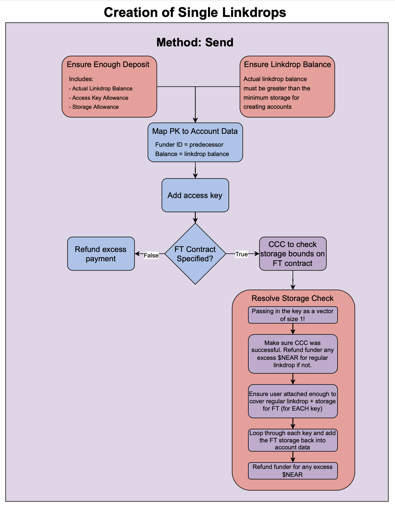
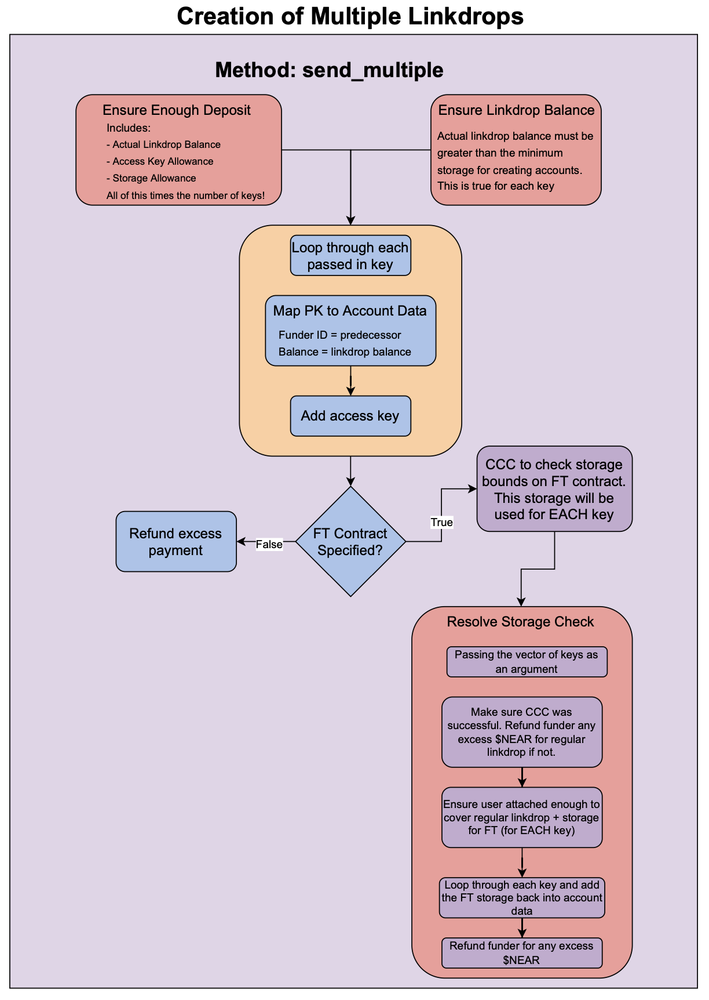
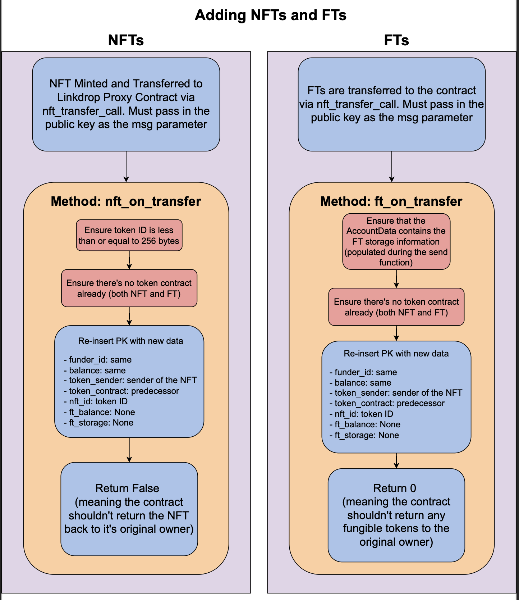
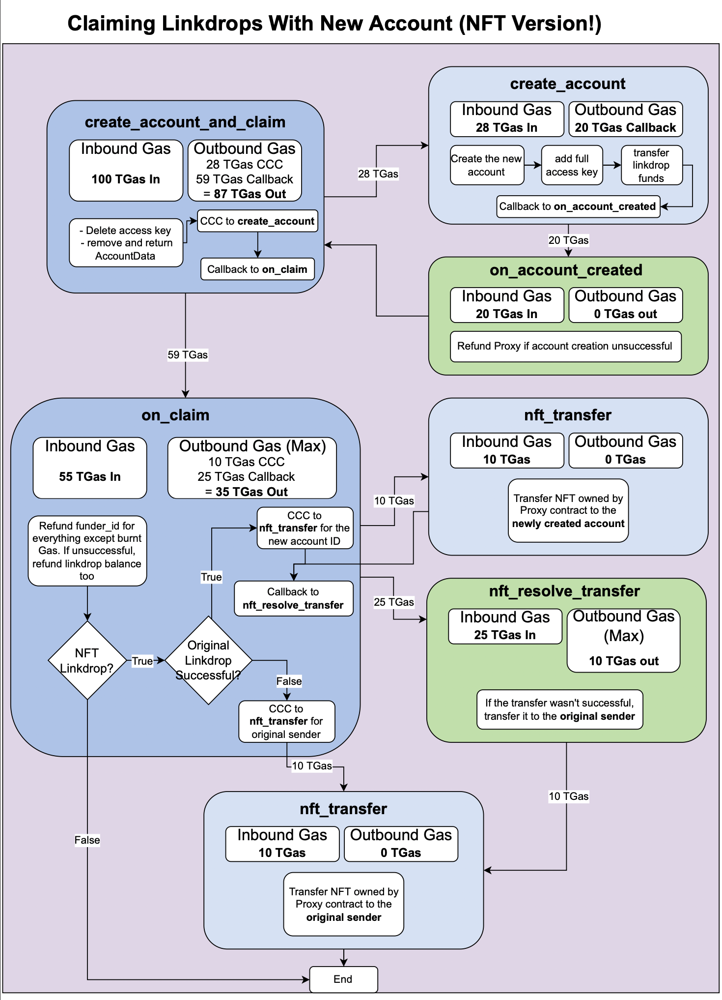
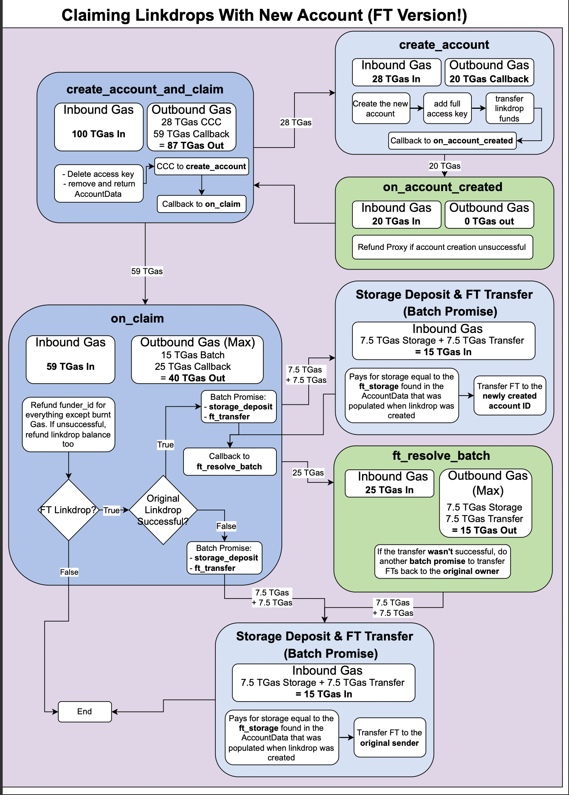
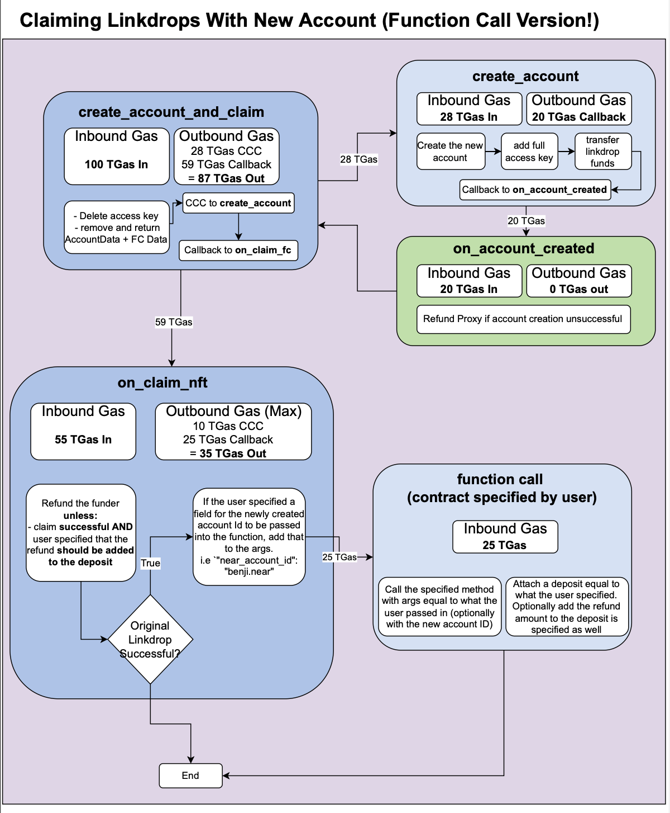
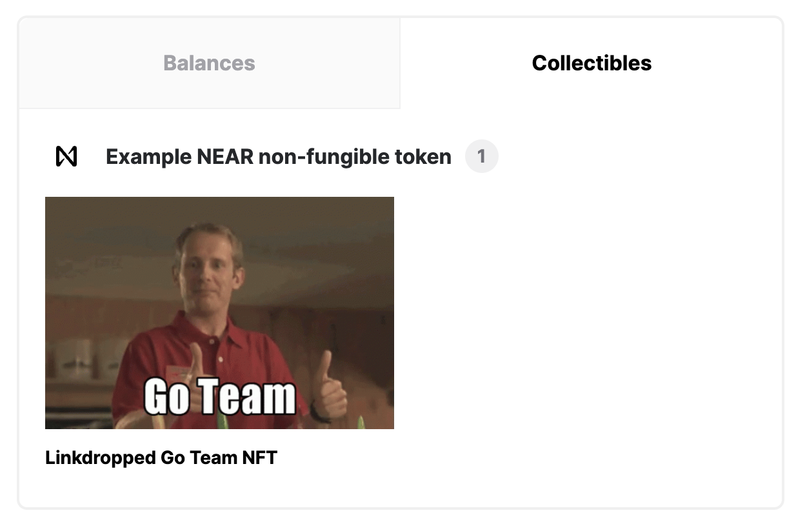
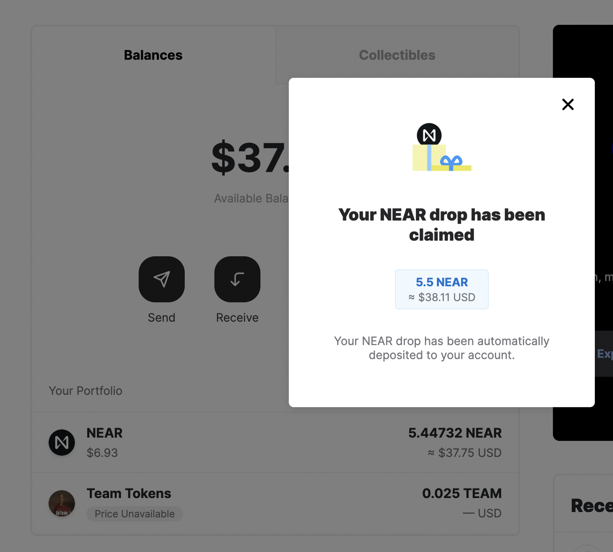
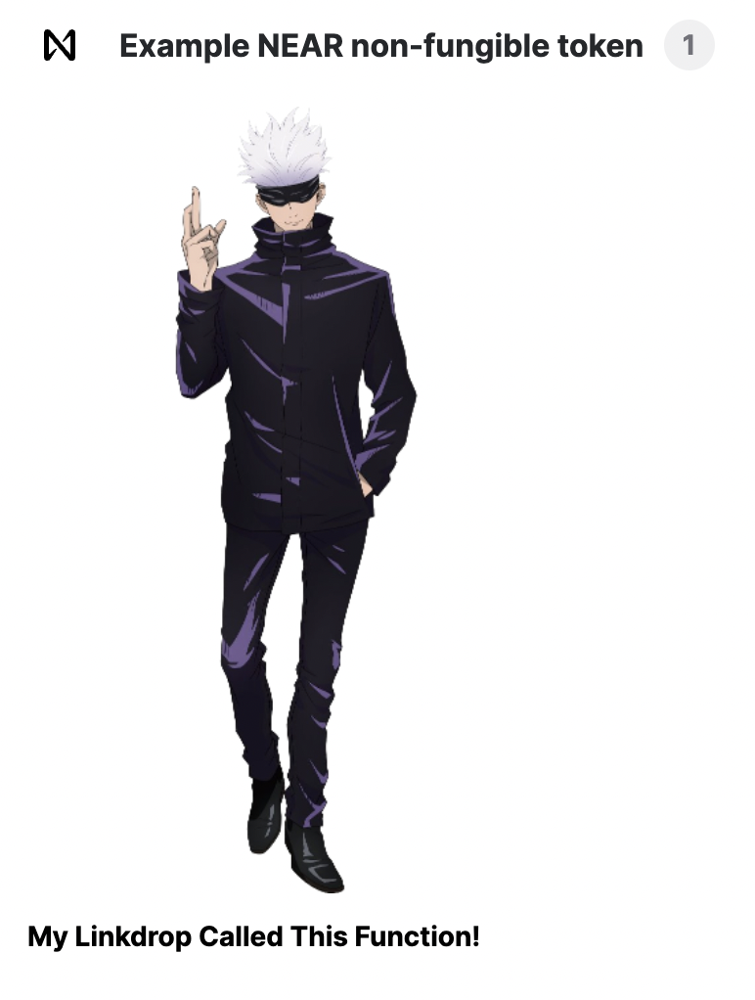

<p align="center">
  
  <br />
</p>

<div align="center">
  <h1>
  NEAR Linkdrop Proxy
  </h1>
  The hub for creating linkdrops containing $NEAR and one of: NFTs, and FTs or an arbitrary function called upon claim
</div>

<div align="center">
<br />

[](https://github.com/BenKurrek)
[](https://github.com/mattlockyer)


</div>

<details open="open">
<summary>Table of Contents</summary>

- [About](#about)
- [How it Works](#how-it-works)
  - [NFTs](#nft-linkdrops)
  - [Fungible Tokens](#fungible-token-linkdrops)
  - [Function Calls](#function-calls)
- [Getting Started](#getting-started)
  - [Prerequisites](#prerequisites)
  - [Quickstart](#quickstart)  
- [Contributing](#contributing)
- [Acknowledgements](#acknowledgements)

</details>

---

# About

<table>
<tr>
<td>

The NEAR linkdrop proxy contract was initially created as a way to handle the hardcoded minimum 1 $NEAR fee for creating linkdrops using the [regular linkdrop contract](https://github.com/near/near-linkdrop/blob/f24f2608e1558db773f2408a28849d330abb3881/src/lib.rs#L18). If users wanted to create linkdrops, they needed to attach a **minimum** of 1 $NEAR. This made it costly and unscalable for projects that wanted to mass create linkdrops for an easy onboarding experience to NEAR.

The proxy contract has a highly optimized fee structure that can be broken down below. Every linkdrop's fees are made up of: 
- Actual linkdrop balance sent to the claimed account (**minimum 0.00284 $NEAR**).
- Access key allowance (**0.02 $NEAR**).
- Storage for creating access key (**0.001 $NEAR**).
- Storage cost for storing information on the proxy contract (**dynamically calculated** but **~0.0015 $NEAR** for a basic linkdrop).

This means that at an absolute **minimum**, you can create a linkdrop for **~0.02534 $NEAR** making it **97.466% cheaper** than the alternate solution. 

In addition, some of this upfront fee **will be refunded** to the funder once the account is created, making it even cheaper. The access key allowance and all storage will be refunded (minus the burnt GAS) once the linkdrop is claimed which makes the true cost of creating a linkdrop roughly `(0.02534 - (0.02 + 0.001 + 0.0015 - 0.01) = 0.01384 $NEAR` which is **~98.616% cheaper**. 

> **NOTE:** any excess $NEAR attached to the call when creating the linkdrop will be automatically refunded to the funder

Key features of the **Linkdrop Proxy Contract**:

- **Batch creation** of linkdrops within the contract.
- Ability to specify a **highly customizable function** to be called when the linkdrop is claimed.
- Ability to pre-load the linkdrop with an **NFT** from **any** NEP-171 compatible smart contract.
- Ability to pre-load the linkdrop with **fungible tokens** from **any** NEP-141 compatible smart contract.
- Extremely **low required deposits** when compared with traditional approaches
- **Customizable balance** that the linkdrop will contain.


</td>
</tr>
</table>

## Built With

- [near-sdk-rs](https://github.com/near/near-sdk-rs)
- [near-api-js](https://github.com/near/near-api-js)

# How it Works

Once the contract is deployed, you can either batch create linkdrops, or you can create them one-by-one. With each basic linkdrop, you have the option to either pre-load them with an NFT, or a fungible token.

For some background as to how the linkdrop proxy contract works on NEAR: 

*The funder that has an account and some $NEAR:* 
- creates a keypair locally `(pubKey1, privKey1)`. The blockchain doesn't know of this key's existence yet since it's all local for now.
- calls `send` on the proxy contract and passes in the `pubKey1` as an argument as well as the desired `balance` for the linkdrop.
    - The contract will map the `pubKey1` to the desired `balance` for the linkdrop.
    - The contract will then add the `pubKey1` as a **function call access key** with the ability to call `claim` and `create_account_and_claim`. This means that anyone with the `privKey1` that was created locally, can claim this linkdrop. 
- Funder will then create a link to send to someone that contains this `privKey1`. The link follows the following format: 
```
    wallet.testnet.near.org/linkdrop/{fundingContractAccountId}/{linkdropKeyPairSecretKey}?redirectUrl={redirectUrl}
```
* `fundingContractAccountId`: The contract accountId that was used to send the funds.
* `linkdropKeyPairSecretKey`: The corresponding secret key to the public key sent to the contract.
* `redirectUrl`: The url that wallet will redirect to after funds are successfully claimed to an existing account. The URL is sent the accountId used to claim the funds as a query param.

*The receiver of the link that is claiming the linkdrop:* 
- Receives the link which includes `privKey1` and sends them to the NEAR wallet.
- Wallet creates a new keypair `(pubKey2, privKey2)` locally. The blockchain doesn't know of this key's existence yet since it's all local for now.
- Receiver will then choose an account ID such as `new_account.near`. 
- Wallet will then use the `privKey1` which has access to call `claim` and `create_account_and_claim` in order to call `create_account_and_claim` on the proxy contract.
    - It will pass in `pubKey2` which will be used to create a full access key for the new account.
- The proxy contract will create the new account and transfer the funds to it alongside any NFT or fungible tokens pre-loaded.

To view information account data information for a given key, you can call the following view function: 

```bash
near view YOUR_LINKDROP_PROXY_CONTRACT get_key_information '{"key": "ed25519:7jszQk7sfbdQy8NHM1EfJi9r3ncyvKa4ZoKU7uk9PbqR"}'
```

Example response:
<p>

```bash
[
  {
    funder_id: 'benjiman.testnet',
    balance: '2840000000000000000000',
    storage_used: '1320000000000000000000',
    cb_id: null,
    cb_data_sent: true
  },
  null,
  null,
  null
]
```
</p>

This will return the Account Data followed by Fungible Token Data, NFT Data, and then Function Call Data. If any of the above don't exist, null is returned in its place.

Below are some flowcharts for creating single linkdrops and batch creating multiple linkdrops.

<p align="center">
  
  <br />
  
</p>


## NFT Linkdrops

With the proxy contract, users can pre-load a linkdrop with **only one** NFT due to GAS constraints. In order to pre-load the NFT, you must:
- create a linkdrop either through `send` or `send_multiple` and specify the NFTData for the NFT that will be pre-loaded onto the linkdrop. The NFT Data struct can be seen below.

```rust
pub struct NFTData {
    pub nft_sender: String,
    pub nft_contract: String,
    pub nft_token_id: String,
}
```

An example of creating an NFT linkdrop can be seen:

```bash
near call linkdrop-proxy.testnet send '{"public_key": "ed25519:2EVN4CVLu5oH18YFoxGyeVkg1c7MaDb9aDrhkaWPqjd7", "balance": "2840000000000000000000", "nft_data": {"nft_sender": "benjiman.testnet", "nft_contract": "example-nft.testnet", "nft_token_id": "token1"}}' --accountId "benjiman.testnet" --amount 1
```

- Once the regular linkdrop has been created with the specified NFT Data, execute the `nft_transfer_call` funtion on the NFT contract and you *must* pass in `pubKey1` (the public key of the keypair created locally and passed into the `send` function) into the `msg` parameter. If the linkdrop is claimed before activation, it will act as a regular linkdrop with no NFT. 

```bash
near call example-nft.testnet nft_transfer_call '{"token_id": "token1", "receiver_id": "linkdrop-proxy.testnet", "msg": "ed25519:4iwBf6eAXZ4bcN6TWPikSqu3UJ2HUwF8wNNkGZrgDYqE"}' --accountId "benjiman.testnet" --depositYocto 1
```

> **NOTE:** you must send the NFT after the linkdrop has been created. You cannot send an NFT with a public key that isn't on the contract yet. The NFT must match exactly what was specified in the NFT data when creating the linkdrop.

<p align="center">
  
</p>

Once the NFT is sent to the contract, it will be registered and you can view the current information about any key using the `get_key_information` function. Upon claiming, the NFT will be transferred from the contract to the newly created account (or existing account) along with the balance of the linkdrop. If any part of the linkdrop claiming process is unsuccessful, **both** the NFT and the $NEAR will be refunded to the funder and token sender respectively.

> **NOTE:** If the NFT fails to transfer from the contract back to the token sender due to a refund for any reason, the NFT will remain on the proxy contract.

If the linkdrop is successfully claimed, the funder will be refunded for everything **except** the burnt GAS and linkdrop balance. This results in the actual linkdrop cost being extremely low (burnt GAS + initial balance).

<p align="center">
  
</p>

## Fungible Token Linkdrops

With the proxy contract, users can pre-load a linkdrop with **only one** type of fungible token due to GAS constraints. The number of fungible tokens, however, is not limited. You could load 1 TEAM token, or a million TEAM tokens. You cannot, however, load 10 TEAM tokens and 50 MIKE tokens at the same time.

Due to the nature of how fungible token contracts handle storage, the user is responsible for attaching enough $NEAR to cover the registration fee. As mentioned in the [About](#about) section, this amount is dynamically calculated before the linkdrop is created in the `send` or `send_multiple` functions. The process for creating fungible token linkdrops is very similar to the NFT linkdrops:

- create a linkdrop either through `send` or `send_multiple` and specify the FTData for the Fungible Tokens that will be pre-loaded onto the linkdrop. The FT Data struct can be seen below.

```rust
pub struct FTData {
    pub ft_contract: String,
    pub ft_sender: String,
    pub ft_balance: U128, // String
    pub ft_storage: Option<U128>, // String
}
```

An example of creating an FT linkdrop can be seen:

```bash
near call linkdrop-proxy.testnet send '{"public_key": "ed25519:2EVN4CVLu5oH18YFoxGyeVkg1c7MaDb9aDrhkaWPqjd7", "balance": "2840000000000000000000", "ft_data": {"ft_sender": "benjiman.testnet", "ft_contract": "ft.benjiman.testnet", "ft_balance": "25"}}' --accountId "benjiman.testnet" --amount 1
```

Once the regular linkdrop is created with the fungible token data, you can the send the fungible tokens to activate the linkdrop. If the linkdrop is claimed before activation, it will act as a regular linkdrop with no FTs.

<p align="center">
  
</p>

Once the regular linkdrop is created with the fungible token data, you can the send the fungible tokens to activate the linkdrop. If the linkdrop is claimed before activation, it will act as a regular linkdrop with no FTs.

- execute the `ft_transfer_call` function on the FT contract and you *must* pass in `pubKey1` (the public key of the keypair created locally and passed into the `send` function) into the `msg` parameter. An example of this can be: 

```bash
near call FT_CONTRACT.testnet ft_transfer_call '{"receiver_id": "linkdrop-proxy.testnet", "amount": "25", "msg": "ed25519:4iwBf6eAXZ4bcN6TWPikSqu3UJ2HUwF8wNNkGZrgDYqE"}' --accountId "benjiman.testnet" --depositYocto 1
```

> **NOTE:** you must send the FT after the linkdrop has been created. You cannot send FTs with a public key that isn't on the contract yet. You are also responsible for registering the proxy contract for the given fungible token contract if it isn't registered already.

Once the fungible tokens are sent to the contract, they will be registered and you can view the current information about any key using the `get_key_information` function. Upon claiming, the proxy contract will register the newly created account (or existing account) on the fungible token contract using the storage you depositted in the `send` function. After this is complete, the fungible tokens will be transferred from the contract to the claimed account along with the balance of the linkdrop. If any part of the linkdrop claiming process is unsuccessful, **both** the fungible tokens and the $NEAR will be refunded to the funder and token sender respectively.

> **NOTE:** If the FT fails to transfer from the contract back to the token sender due to a refund for any reason, the fungible tokens will remain on the proxy contract.

If the linkdrop is successfully claimed, the funder will be refunded for everything **except** the burnt GAS, linkdrop balance, and fungible token storage.

<p align="center">
  
  <br />
</p>

## Function Calls

With the proxy contract, users can specify a function that will be called when the linkdrop is claimed. This function call is highly customizable including:
- Any method on any contract
- Any deposit to attach to the call
- Whether or not the refund that normally goes to the funder should be sent along with the deposit
- Specifying a specific field for the claiming account to be called with.

Let's look at an example to see the power of the proxy contract. If a user wants to be able to lazy mint an NFT to the newly created account (that is unknown at the time of creating the linkdrop) but the mint function takes a parameter `receiver_id` and a deposit of 1 $NEAR, you could specify these parameters. The struct that must be passed in when creating a function call linkdrop is below.

```rust
pub struct FCData {
    // Contract that will be called
    pub receiver: String,
    // Method to call on receiver contract
    pub method: String,
    // Arguments to pass in (stringified JSON)
    pub args: String,
    // Amount of yoctoNEAR to attach along with the call
    pub deposit: U128,
    // Should the refund that normally goes to the funder be attached alongside the deposit?
    pub refund_to_deposit: Option<bool>,
    // Specifies what field the claiming account should go in when calling the function
    pub claimed_account_field: Option<String>,
}
```

If there was a different NFT contract where the parameter was `nft_contract_id` instead, that is also possible. You can specify the exact field that the claiming account ID should be passed into. An example flow of creating a function call linkdrop is below.

- create a linkdrop either through `send` or `send_multiple` and specify the FC (function call) data for the function that will be called upon claim

```bash
near call linkdrop-proxy.testnet send '{"public_key": "ed25519:2EVN4CVLu5oH18YFoxGyeVkg1c7MaDb9aDrhkaWPqjd7", "balance": "2840000000000000000000", "fc_data": {"receiver": "example-nft.testnet", "method": "nft_mint", "args": "{\"token_id\":\"ed25519:Db3ALuBMU2ruMNroZfwFC5ZGMXK3bRX12UjRAbH19LZL\",\"token_metadata\":{\"title\":\"My Linkdrop Called This Function!\",\"description\":\"Linkdrop NFT that was lazy minted when the linkdrop was claimed\",\"media\":\"https://bafybeicek3skoaae4p5chsutjzytls5dmnj5fbz6iqsd2uej334sy46oge.ipfs.nftstorage.link/\",\"media_hash\":null,\"copies\":10000,\"issued_at\":null,\"expires_at\":null,\"starts_at\":null,\"updated_at\":null,\"extra\":null,\"reference\":null,\"reference_hash\":null}}", "deposit": "1000000000000000000000000", "refund_to_deposit": true, "claimed_account_field": "receiver_id" }}' --accountId "benjiman.testnet" --amount 1
```

This will create a linkdrop for `0.00284 $NEAR` and specify that once the linkdrop is claimed, the method `nft_mint` should be called on the contract `example-nft.testnet` with a set of arguments that are stringified JSON. In addition, an **extra field called receiver_id** should be **added to the args** and the claiming account ID will be set for that field in the arguments.

> **NOTE:** you must attach enough $NEAR to cover the attached deposit. If the linkdrop claim fails, your $NEAR will be refunded and the function call will NOT execute.

<p align="center">
  
</p>

# Getting Started

## Prerequisites

In order to successfully use this contract, you should have the following installed on your machine: 


- [NEAR account](https://docs.near.org/docs/develop/basics/create-account)
- [rust toolchain](https://docs.near.org/docs/develop/contracts/rust/intro#installing-the-rust-toolchain)
- [NEAR CLI](https://docs.near.org/docs/tools/near-cli#setup)

If you want to run the deploy scripts, you'll need:
- [Node JS](https://docs.npmjs.com/downloading-and-installing-node-js-and-npm)

## Quickstart

The project comes with several useful scripts in order to test and view functionalities for creating linkdrops. Each script can be set to either batch create linkdrops or create them one by one:

- [simple.js](deploy/simple.js) creating linkdrops preloaded with just $NEAR
- [nft.js](deploy/nft.js) creating linkdrops preloaded with $NEAR and an NFT
- [ft.js](deploy/ft.js) creating linkdrops preloaded with $NEAR and fungible tokens.
- [function-call.js](deploy/funtion-call.js) creating linkdrops preloaded with $NEAR and fungible tokens.

In addition, there is a test script that will create a function call recursive linkdrop that keeps calling the contract to create a new linkdrop once the old one is claimed. To test it out, visit the [recursive-fc.js](deploy/recursive-fc.js) script.

The first step is to compile the contract to WebAssembly by running:

```
yarn build-contract
```
This will create the directory `out/main.wasm` where you can then deploy the contract using:

```
near deploy --wasmFile out/main.wasm --accountId YOUR_CONTRACT_ID.testnet
```

> **NOTE:** you must replace `YOUR_CONTRACT_ID.testnet` with the actual NEAR account ID you'll be using.


Once deployed, you need to initialize the contract with the external linkdrop contract you want to interact with. In most cases, this will be `near` or `testnet` since you'll want to create sub-accounts of `.testnet` (i.e `benjiman.testnet`).

```
near call YOUR_CONTRACT_ID.testnet new '{"linkdrop_contract": "testnet"}' --accountId YOUR_CONTRACT_ID.testnet
```

You're now ready to create custom linkdrops! You can either interact with the contract directly using the CLI or use one of the pre-deployed scripts.

## Using the CLI
After the contract is deployed, you have a couple options for creating linkdrops: 

- Creating single linkdrops.
- Creating multiple linkdrops at a time.

This will cover creating single linkdrops, however, the only differences between `send` and `send_multiple` are outlined in the [how it works](#how-it-works) flowchart section. 

- Start by creating a keypair locally (you can use near-api-js to do this as seen in the deploy scripts).
- Call the `send` function and pass in the `public_key`, `balance`. If creating a FT, NFT, or FC linkdrop, you must specify the struct as well. This is outlined in the respective sections.  

```bash
near call YOUR_CONTRACT_ID.testnet send '{"public_key": "ed25519:4iwBf6eAXZ4bcN6TWPikSqu3UJ2HUwF8wNNkGZrgDYqE", "balance": "10000000000000000000000"}' --deposit 1 --accountId "benjiman.testnet"
```

Once the function is successful, you can create the link and click it to claim the linkdrop:
```
    wallet.testnet.near.org/linkdrop/{YOUR_CONTRACT_ID.testnet}/{privKey1}
```

## Using the pre-deployed scripts

If you'd like to use some of the deploy scripts found in the `deploy` folder, those can help automate the process. 
<br />

### Simple Linkdrops with No NFTs or FTs

If you'd like to create a simple linkdrop with no pre-loaded NFTs or FTs, first specify the following environment variables:

```bash
export LINKDROP_PROXY_CONTRACT_ID="INSERT_HERE"
export FUNDING_ACCOUNT_ID="INSERT_HERE"
export LINKDROP_NEAR_AMOUNT="INSERT_HERE"
export SEND_MULTIPLE="false"
```

This will set the proxy contract that you wish to create linkdrops on, the account ID of the funding address (person creating the linkdrops and sending the funds), the actual $NEAR amount that the linkdrop will contain and whether or not to batch create linkdrops. By default, if the batch option is true, it will create 5 linkdrops. 

It is recommended to simply run a `dev-deploy` and use the dev contract ID to test these scripts. Once this is finished, run the following script:

```
node deploy/simple.js
```

Once the script has finished executing, a link to the wallet should appear in your console similar to: 

```bash
https://wallet.testnet.near.org/linkdrop/dev-1652794689263-24159113353222/4YULUt1hqv4s96Z8K83VoPnWqXK9vjfYb5QsBrv793aZ2jucBiLP35YWJq9rPGziRpDM35HEUftUtpP1WLzFocqJ
```

Once you've clicked the link, you can either fund an existing account with the linkdrop balance, or you can create a new account and fund it that way.
<br />

### Linkdrops with NFTs

If you'd like to create a linkdrop with a pre-loaded NFT, first specify the following environment variables:

```bash
export LINKDROP_PROXY_CONTRACT_ID="INSERT_HERE"
export FUNDING_ACCOUNT_ID="INSERT_HERE"
export LINKDROP_NEAR_AMOUNT="INSERT_HERE"
export SEND_MULTIPLE="false"
```

If you ran the script now, it would mint a predefined NFT on the contract `example-nft.testnet`. If you wish to change the NFT contract or the metadata for the token, simply open the `deploy/nft.js` script and change the following lines:

```js
/*
	Hard coding NFT contract and metadata. Change this if you want.
*/
let NFT_CONTRACT_ID = "example-nft.testnet";
const METADATA = {
	"title": "Linkdropped Go Team NFT",
	"description": "Testing Linkdrop NFT Go Team Token",
	"media": "https://bafybeiftczwrtyr3k7a2k4vutd3amkwsmaqyhrdzlhvpt33dyjivufqusq.ipfs.dweb.link/goteam-gif.gif",
	"media_hash": null,
	"copies": 10000,
	"issued_at": null,
	"expires_at": null,
	"starts_at": null,
	"updated_at": null,
	"extra": null,
	"reference": null,
	"reference_hash": null
};
```

Once you've either changed the NFT info or you're happy with minting a Go Team NFT on the example NFT contract, run the NFT script:

```
node deploy/nft.js
```

Once the script has finished executing, a link to the wallet should appear in your console similar to: 

```bash
https://wallet.testnet.near.org/linkdrop/dev-1652794689263-24159113353222/4YULUt1hqv4s96Z8K83VoPnWqXK9vjfYb5QsBrv793aZ2jucBiLP35YWJq9rPGziRpDM35HEUftUtpP1WLzFocqJ
```

Once you've clicked the link, you can either fund an existing account with the linkdrop balance, or you can create a new account and fund it that way. When this is finished, navigate to your collectibles tab and you should see an NFT similar to:

<p align="center">
  
  <br />
</p>

## Linkdrops with FTs

If you'd like to create a linkdrop with some pre-loaded FTs, you'll need to first specify the following environment variables:

```bash
export LINKDROP_PROXY_CONTRACT_ID="INSERT_HERE"
export FUNDING_ACCOUNT_ID="INSERT_HERE"
export LINKDROP_NEAR_AMOUNT="INSERT_HERE"
export SEND_MULTIPLE="false"
```

In addition, you need to specify the FT contract ID you'd like to pre-load the linkdrop with.

```bash
export FT_CONTRACT_ID="INSERT_HERE"
```
> **NOTE:** the FT script will pay for the proxy contract's storage but the funding account ID must be in possession of at least 25 FTs or else the script will panic.

Once this is finished, run the FT script.

```
node deploy/ft.js
```

Once the script has finished executing, a link to the wallet should appear in your console similar to: 

```bash
https://wallet.testnet.near.org/linkdrop/dev-1652794689263-24159113353222/4YULUt1hqv4s96Z8K83VoPnWqXK9vjfYb5QsBrv793aZ2jucBiLP35YWJq9rPGziRpDM35HEUftUtpP1WLzFocqJ
```

Once you've clicked the link, you can either fund an existing account with the linkdrop balance, or you can create a new account and fund it that way. When this is finished, you should see your fungible tokens:

<p align="center">
  
</p>

### Linkdrops with Function Calls

If you'd like to create a linkdrop whereby a function will be called upon claiming, first specify the following environment variables.

```bash
export LINKDROP_PROXY_CONTRACT_ID="INSERT_HERE"
export FUNDING_ACCOUNT_ID="INSERT_HERE"
export LINKDROP_NEAR_AMOUNT="INSERT_HERE"
export SEND_MULTIPLE="false"
```

This script will lazy mint an NFT once the linkdrop is claimed. Feel free to edit the logic in the script if you'd like to call a different function.

```
node deploy/function-call.js
```

Once the script has finished executing, a link to the wallet should appear in your console similar to: 

```bash
https://wallet.testnet.near.org/linkdrop/dev-1652794689263-24159113353222/4YULUt1hqv4s96Z8K83VoPnWqXK9vjfYb5QsBrv793aZ2jucBiLP35YWJq9rPGziRpDM35HEUftUtpP1WLzFocqJ
```

Once you've clicked the link, you can either fund an existing account with the linkdrop balance, or you can create a new account and fund it that way. When this is finished, navigate to your collectibles tab and you should see an NFT similar to:

<p align="center">
  
  <br />
</p>

# Contributing

First off, thanks for taking the time to contribute! Contributions are what makes the open-source community such an amazing place to learn, inspire, and create. Any contributions you make will benefit everybody else and are **greatly appreciated**.

Please try to create bug reports that are:

- _Reproducible._ Include steps to reproduce the problem.
- _Specific._ Include as much detail as possible: which version, what environment, etc.
- _Unique._ Do not duplicate existing opened issues.
- _Scoped to a Single Bug._ One bug per report.

Please adhere to this project's [code of conduct](docs/CODE_OF_CONDUCT.md).

You can use [markdownlint-cli](https://github.com/igorshubovych/markdownlint-cli) to check for common markdown style inconsistency.

# License

This project is licensed under the **GPL License**.

# Acknowledgements

Thanks for these awesome resources that were used during the development of the **Linkdrop Proxy Contract**:

- <https://github.com/dec0dOS/amazing-github-template>
- <https://github.com/near/near-linkdrop>
- <https://github.com/near/near-wallet/blob/master/packages/frontend/docs/Linkdrop.md>
